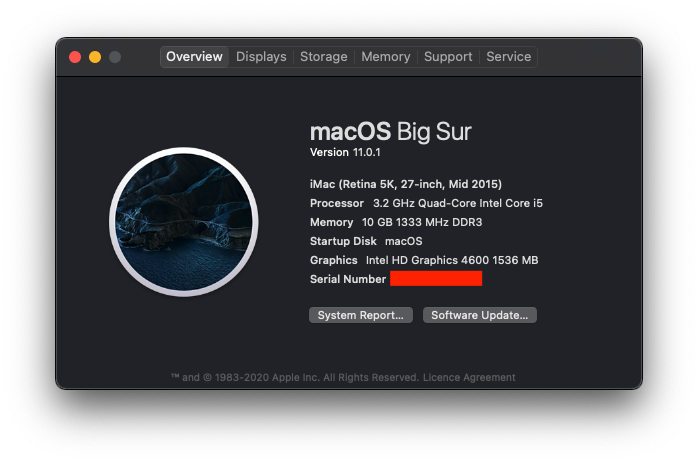

# Hackintosh Opencore 0.6.3 for ACER XC-605 - macOS(>=11.0.1) 

### This guide is not intended for beginner, you have been warned. No support is provided unless there is a valid issue. Please read everything before starting

### Hardware

ACER XC-605 

Type|Item
:----|:----
**CPU** | i5 4460
**Memory** | 10GB
**Storage** | KINGSTON UV400 128GB
**GPU** | HD 4600
**WiFi+BT** | DW1550

### Prerequisite 
Please understand all OpenCore configuration by reading [Configuration.pdf](https://github.com/acidanthera/OpenCorePkg/blob/master/Docs/Configuration.pdf) 

### Required Tools
- [GenSMBIOS](https://github.com/corpnewt/GenSMBIOS)
- [EFI-Agent](https://github.com/headkaze/EFI-Agent)
- [Hackintool](https://github.com/headkaze/Hackintool)

### Step By Step Installation Guide
1. [BIOS configuration](BIOS.md)
2. [macOS installation media](INSTALLER.md)
3. [OpenCore EFI](OC.md)
4. [Post Installation](POST_INSTALL.md)

##### Working
- Ethernet
- Onboard Audio
- HDMI Audio
- App Store
- Wake/Sleep
- Restart/Shutdown
- USB (Correct SS/HS speed)
- Apple Music (iTunes)
- iServices
- Continuity
- WiFi+BT

##### Not Tested
- FileVault
- Power Nap

##### Not Working
- DRM
